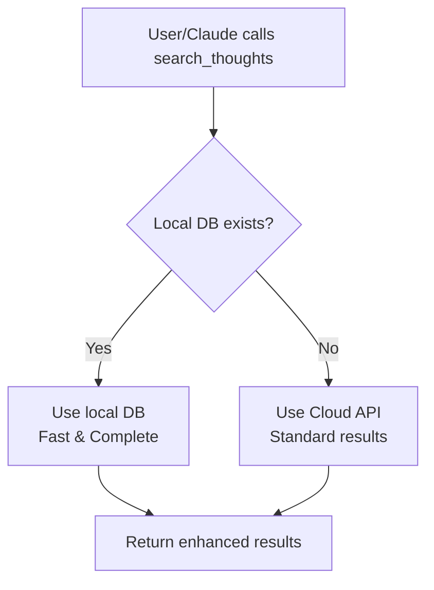

# Automatic Hybrid Mode - Zero Configuration Required

## The Magic: It Just Works™

You don't need to know about "hybrid" functions or make any special calls. The system **automatically** uses the best available method:

- **Local database** when available (fast, complete)
- **Cloud API** as fallback (always works)

## How It Works

### Regular Function Calls = Smart Behavior

When you call standard functions, they automatically detect and use local databases:

```python
# You call this normal function...
search_thoughts({"queryText": "tag:Mega"})

# Behind the scenes, it automatically:
1. Checks for local database at C:\Users\[name]\Brains\
2. Finds and uses it for instant, complete results
3. Falls back to API only if no local DB exists
```

## No Special Knowledge Required

### ❌ What You DON'T Need to Do:
- Call special "_hybrid" functions
- Know about local vs cloud
- Configure database paths
- Manage sync manually
- Choose which method to use

### ✅ What You DO:
- Just use the normal functions
- Get better results automatically
- Enjoy faster performance

## Functions That Auto-Upgrade

These functions automatically use local database when available:

| Function | Without Local DB | With Local DB |
|----------|-----------------|---------------|
| `search_thoughts` | Limited API results, some without IDs | Complete results, all IDs, tags work! |
| `get_thought_graph` | Basic relationships | Full graph with tags, notes, all connections |
| `get_brain_stats` | Basic counts | Comprehensive statistics, orphan analysis |

## Special Syntax Now Works

Because local database is used automatically, these now work:

```python
# Tag search - WORKS!
search_thoughts({"queryText": "tag:Mega"})

# Type filtering - WORKS!
search_thoughts({"queryText": "type:Project"})

# Recent modifications - WORKS!
search_thoughts({"queryText": "recent:7"})

# Note content search - WORKS!
search_thoughts({"queryText": "some text", "searchInNotes": true})
```

## The Decision Flow



## What Happens Behind the Scenes

### First Time:
1. Function called
2. System checks `C:\Users\[name]\Brains\`
3. Finds `U00\User.db`, `U01\User.db`, etc.
4. Verifies which has your brain
5. Uses it for instant results
6. Caches for future use

### Subsequent Calls:
1. Function called
2. Uses cached local database
3. Returns results in milliseconds

## For Claude/AI Assistants

Just call the normal functions:

```
"Search for thoughts tagged with Mega"
→ Uses search_thoughts with "tag:Mega"
→ Automatically uses local DB
→ Returns complete results
```

No need to:
- Request "hybrid" functions
- Ask about local database
- Specify special parameters

## Manual Controls (Optional)

While everything is automatic, you can:

### Force Cloud Sync:
```python
sync_brain_data({"forceDownload": true})
```

### Check What's Being Used:
Look for `"usingLocalDatabase": true` in responses

## Benefits of Automatic Mode

1. **Zero Learning Curve**: Use standard functions
2. **Best Performance**: Automatically uses fastest method
3. **Graceful Fallback**: Works even without local DB
4. **No Configuration**: No setup required
5. **Backward Compatible**: Existing code gets upgraded

## Examples

### Before (Manual Selection):
```python
# Had to know about and choose hybrid function
search_thoughts_hybrid({"queryText": "tag:Mega"})  # Confusing!
```

### Now (Automatic):
```python
# Just use normal function
search_thoughts({"queryText": "tag:Mega"})  # It just works!
```

## Summary

The system is now **intelligent by default**. You don't need to:
- Know about hybrid mode
- Choose between local and cloud
- Call special functions
- Configure anything

Just use the normal TheBrain MCP functions and get the best possible results automatically! 🚀
